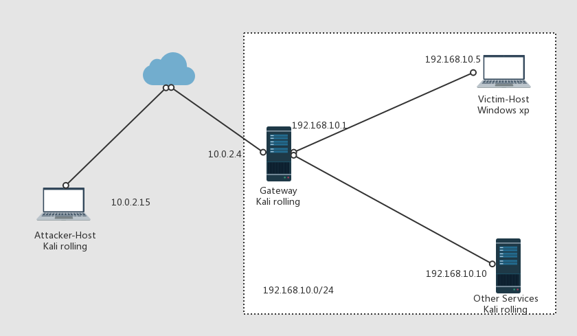

# 环境搭建  
  
## 系统要求及配置   
 
1. attacker-host(攻击者): kali-2017.1.64bits(增强功能安装方法)     
2. gateway(攻击者): kali-2017.1.64bits  镜像：[https://mirrors.tuna.tsinghua.edu.cn/kali-images/kali-2017.1/kali-linux-2017.1-amd64.iso](https://mirrors.tuna.tsinghua.edu.cn/kali-images/kali-2017.1/kali-linux-2017.1-amd64.iso)
3. victim-host(受害者)： windows xp sp3 32 bits 镜像：[https://sec.cuc.edu.cn/ftp/iso/zh-hans_windows_xp.iso](https://sec.cuc.edu.cn/ftp/iso/zh-hans_windows_xp.iso)  
4. 其他内网服务等 (例如 ftp  www 等) 拟采用 虚拟机 + docker的方式  ...   
  
## 网络环境与网络拓扑  
  
网络拓扑图：  

   
  
内部的局域网采用的是内部网络模式,暂时采用手工配置ip的方式。  
外网环境是采用nat网络来模拟的。   

在网关上进行如下操作(若重启网关需重复操作)：  
  
	iptables -t nat -A POSTROUTING -s 192.168.10.0/24 -o eth0 -j MASQUERADE 
	echo 1 > /proc/sys/net/ipv4/ip_forward   

实现内网可访问外网、互联网(暂时没有配DNS服务)，外网不可访问内网。   
  
#### dns服务 

在网关的kali上面安装dnsmasp (apt-get install dnsmasq)  
  
修改 /etc/resolv.conf   
 
修改为  
  
		nameserver 8.8.8.8
		nameserver 202.205.16.4     
  
分别对应google的dns服务和学校的dns服务。
重启dnsmasq(service dnsmasq restart)  
将对应的主机的dns server设置成192.168.10.1即可
  

#### kali 2017 1 增强功能安装方法  
  
1. 确保 /etc/apt/sources.list中的记录为官方源 

		deb http://http.kali.org/kali kali-rolling main non-free contrib
 
2. 更新和下载所需软件
	
		apt-get update  
 		apt-get install linux-headers-4.9.0-kali4-all-amd64  
		apt-get install linux-image-4.9.0-kali4-amd64  
		apt-get install virtualbox-guest-x11     
 
中间如果有error出错，尝试使用apt-get update --fix-missing 后再重复尝试安装
 
3. 重启即可